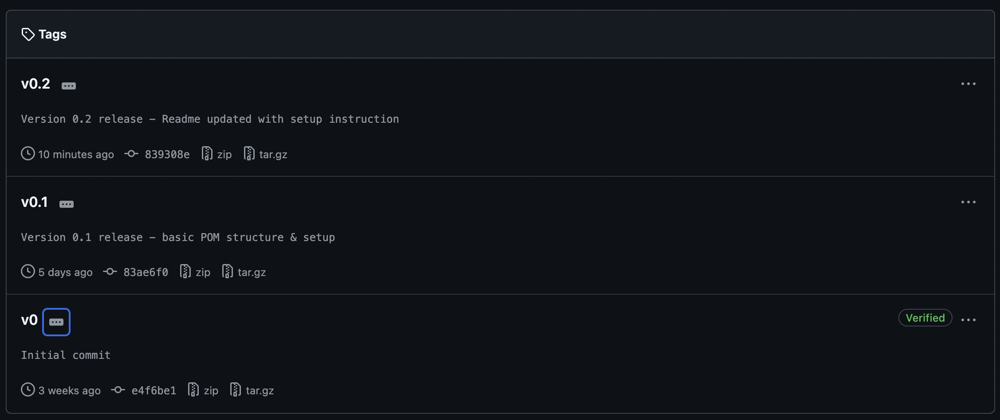

# QE Automation Cross Skilling Project!

> An adventure into showcasing git skills, JS/ TS skills and foundational understanding on automation best practices.

## Table of Contents

- [Motivation](#motivation)
- [Requirements](#requirements)
  - [Installation](#installation)
- [Usage](#usage)
  - [Running tests](#running-tests)
  - [Expected failures](#expected-failures)
  - [Skipped tests](#skipped-tests)
  - [Github Actions](#github-actions)
- [Contribution](#contribution)
- [Future Improvements](#future-improvements)

## Motivation

As part of the Quality Engineering cross-skilling plan, we have been tasked with upskilling into the Automation capability.  
To achieve this and to showcase my skills, I've chosen the following site that will allow me to write UI smoke tests, functional tests and API tests.  
https://automationintesting.online/

This repo uses the Playwright to test this website that contains both working functionality and known bugs. This will allow for the demonstration of my testing strategy, including how failed tests are handled and reported.

## Getting Started

### Prerequisites

This repo is currently known to work with the following minimum requirements:

- Node v18.20.2
- Npm 10.5.0

Using the command line interpreter 'Bash' you can check the versions of each as follows:

- Node: node -v
- Npm: npm -v

If you do not have these installed, the recommended approach to installing them is to visit the [official website](https://nodejs.org/en) and follow the most appropraite path from there.  
_Note: Npm comes with the installation of Node.js._

### Setup

Once npm & node are installed, we can focus on setting up our project.

1. Navigate to the folder you wish to store the repository in
   cd <your-project-directory>
2. Clone the repository
   `git clone https://github.com/Liam-XD/cf-cross-skilling.git`
3. Install all project dependencies with the following command:  
   `npm install`
4. Install Playwright browsers with the following command:
   `npx playwright install`

That should be it! You should now be able to run the Playwright scripts as per the below commands listed under [running tests](#running-tests)

## Usage

Currently there are tests written for the following areas...
Smoke tests for:

- Hero section
- Check availability section
- Navigation bar functionality

### Running tests

Command shortcuts have been setup within the 'scripts' section of the packackage.json file.

To run the tests locally, use the following commands:

- `npm run test` - Will run all tests headless
- `npm run test:headed` - Will run all tests in the browser
- `npm run test:ui` - Will launch the tests in UI mode for exploring and debugging tests.

To see the test report, either click the provided link in the terminal or type the following:

- `npm run report` - Will open up the latest test report.

### Expected failures

Tests which we expect to fail, due to identified broken functionality on the website, have been marked with `test.fail()`

This will ensure the test is actually failing and therefore return it as 'passed'.  
More info [here](https://playwright.dev/docs/api/class-test#test-fail)

### Skipped tests

Tests where the functionality is not yet implemented on the website have been marked with `test.skip()`

This will ensure Playwright does not run the script and instead returns is as 'skipped' in the reporting.
More info [here](https://playwright.dev/docs/api/class-test#test-skip)

### Github Actions

A basic Github Actions workflow has been configured on this repository (.github/workflows/playwright.yml). This workflow will be triggered on every push and pull_request to the main branch.  
This workflow will...

1. Install Node.js and project dependencies
2. Install Playwright browser binaries
3. Execute the test suite
4. Upload the test report as an artifact.

The results of this workflow can be viewed under the 'Actions' tab within GitHub.

## Contribution

Contributions and feedback are welcome, although I expect this to be a solo project!  
As such, I've added branch protection.  
Commits must therefore be made on a non-protected branch (basically not on main) and submitted via a pull request. As code owner I can then review and include in the main branch upon approval.

Specific points in the repositories history have been tagged using the git tagging functionality, to highlight when key updates have been made:

## Future Improvements

This is only the beginning for the repository.
While some smoke tests have been written, not all areas have been covered.
I would also like to write tests for...

- Room booking
- Admin login
- API calls

_**Watch this space!**_
